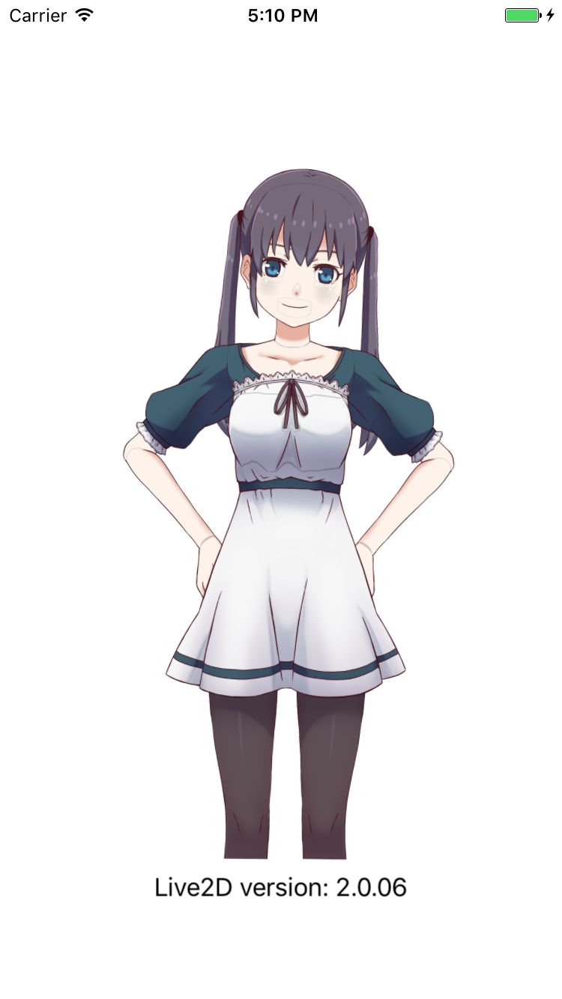

# TYLive2D

[](https://travis-ci.org/luckytianyiyan/TYLive2D)
[](http://cocoapods.org/pods/TYLive2D)
[](http://cocoapods.org/pods/TYLive2D)
[](http://cocoapods.org/pods/TYLive2D)
[](https://github.com/Carthage/Carthage)

Inspiration from [DaidoujiChen/DaiLive2DPlayground](https://github.com/DaidoujiChen/DaiLive2DPlayground)

## Example

To run the example project, clone the repo, and run `pod install` from the Example directory first.



## Installation

#### CocoaPods
**TYLive2D** is available through [CocoaPods](http://cocoapods.org). To install
it, simply add the following line to your Podfile:

```ruby
pod 'TYLive2D'
```

#### Carthage

[Carthage](https://github.com/Carthage/Carthage) is a decentralized dependency manager that builds your dependencies and provides you with binary frameworks.

You can install Carthage with [Homebrew](http://brew.sh/) using the following command:
```shell
$ brew update
$ brew install carthage
```
To integrate **TYLive2D** into your Xcode project using Carthage, specify it in your `Cartfile`:
```
github "luckytianyiyan/TYLive2D"
```
Run `carthage` to build the framework and drag the built `TYLive2D.framework` into your Xcode project.

## Author

luckytianyiyan, luckytianyiyan@gmail.com

## License

TYLive2D is available under the MIT license. See the LICENSE file for more info.
